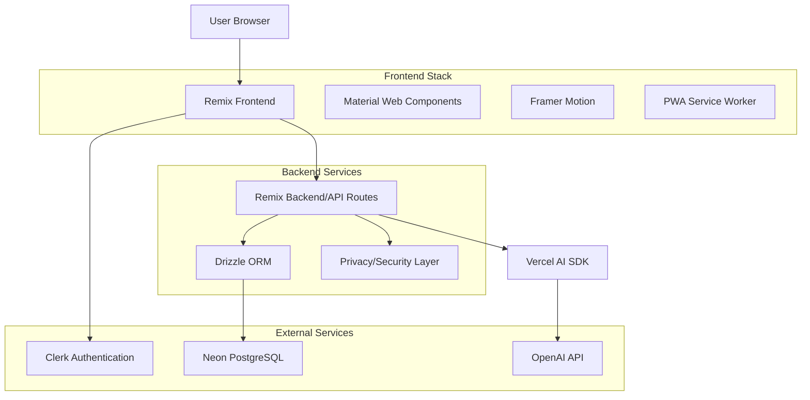
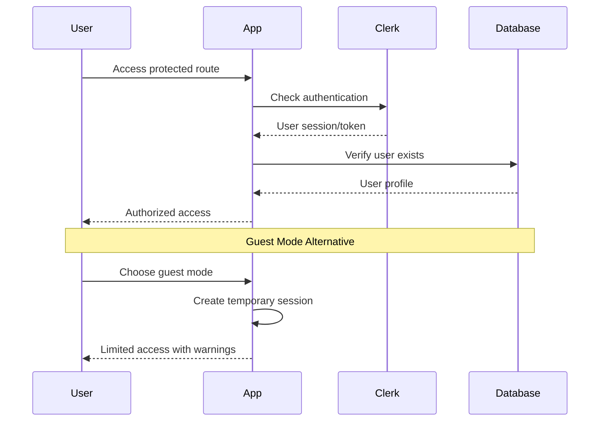

# Design Document

## Overview

Relationship Mojo is a modern, AI-powered web application built using Remix (React-based full-stack framework) that provides users with comprehensive relationship self-analysis through a 50-question psychological assessment. The application leverages established psychological frameworks to generate personalized insights using AI, presented through an engaging, accessible interface with smooth animations and responsive design.

The application follows a progressive web app (PWA) architecture with mobile-first design principles, ensuring optimal performance across all devices while maintaining high accessibility standards and data privacy compliance.

## Architecture

### High-Level Architecture



### Technology Stack

**Frontend Framework:**
- Remix (React-based full-stack framework)
- Material Web Components (@material/web) for UI consistency
- Framer Motion for animations and transitions
- Progressive Web App capabilities

**Backend & Data:**
- Neon PostgreSQL for data persistence
- Drizzle ORM for type-safe database operations
- Clerk for authentication and user management

**AI Integration:**
- Vercel AI SDK for AI orchestration
- OpenAI API for analysis generation
- Custom prompt engineering for psychological analysis

**Deployment:**
- Fly.io, Render, or Vercel for hosting
- CDN for static asset delivery

## Components and Interfaces

### Core Application Structure

```
app/
├── routes/
│   ├── _index.tsx                 # Landing page
│   ├── auth.$.tsx                 # Clerk authentication
│   ├── assessment.tsx             # Assessment flow container
│   ├── assessment.$section.tsx    # Individual assessment sections
│   └── results.$analysisId.tsx    # Results dashboard
├── components/
│   ├── ui/                        # Reusable UI components
│   ├── assessment/                # Assessment-specific components
│   ├── results/                   # Results visualization components
│   └── layout/                    # Layout and navigation
├── lib/
│   ├── ai/                        # AI integration utilities
│   ├── db/                        # Database utilities
│   ├── auth/                      # Authentication helpers
│   └── utils/                     # General utilities
└── styles/                        # Global styles and themes
```

### Key Component Interfaces

#### Assessment Components

```typescript
// app/components/assessment/QuestionCard.tsx
interface QuestionCardProps {
  question: Question;
  currentAnswer: Answer | null;
  onAnswer: (answer: Answer) => void;
  onNext: () => void;
  onPrevious: () => void;
  isFirst: boolean;
  isLast: boolean;
}

// app/components/assessment/ProgressIndicator.tsx
interface ProgressIndicatorProps {
  currentSection: number;
  currentQuestion: number;
  totalSections: number;
  totalQuestions: number;
  completionPercentage: number;
}

// app/components/assessment/SectionSelector.tsx
interface SectionSelectorProps {
  sections: AssessmentSection[];
  currentSection: number;
  completedSections: number[];
  onSectionSelect: (sectionId: number) => void;
}
```

#### Results Components

```typescript
// app/components/results/AnalysisCard.tsx
interface AnalysisCardProps {
  title: string;
  content: string;
  visualData?: ChartData;
  isExpandable?: boolean;
  animationDelay?: number;
}

// app/components/results/AttachmentRadarChart.tsx
interface AttachmentRadarChartProps {
  scores: {
    secure: number;
    anxiousPreoccupied: number;
    dismissiveAvoidant: number;
    fearfulAvoidant: number;
  };
}
```

### API Route Interfaces

```typescript
// app/routes/api/assessment.tsx
export interface AssessmentSubmission {
  userId: string;
  responses: QuestionResponse[];
  demographics?: UserDemographics;
}

export interface AnalysisResponse {
  analysisId: string;
  report: AnalysisReport;
  visualizations: ChartData[];
  recommendations: Recommendation[];
}

// app/routes/api/ai-analysis.tsx
export interface AIAnalysisRequest {
  responses: QuestionResponse[];
  userProfile: UserProfile;
}

export interface AIAnalysisResponse {
  executiveSummary: string;
  detailedAnalysis: SectionAnalysis[];
  synthesis: string;
  recommendations: string[];
}
```

## Data Models

### Database Schema (Drizzle ORM)

```typescript
// schema/users.ts
export const users = pgTable('users', {
  id: uuid('id').primaryKey().defaultRandom(),
  clerkId: text('clerk_id').unique().notNull(),
  email: text('email').notNull(),
  demographics: jsonb('demographics').$type<UserDemographics>(),
  createdAt: timestamp('created_at').defaultNow(),
  updatedAt: timestamp('updated_at').defaultNow(),
});

// schema/assessments.ts
export const assessments = pgTable('assessments', {
  id: uuid('id').primaryKey().defaultRandom(),
  userId: uuid('user_id').references(() => users.id).notNull(),
  responses: jsonb('responses').$type<QuestionResponse[]>().notNull(),
  analysisResult: jsonb('analysis_result').$type<AnalysisReport>(),
  status: text('status').$type<'in_progress' | 'completed' | 'failed'>().default('in_progress'),
  completedAt: timestamp('completed_at'),
  createdAt: timestamp('created_at').defaultNow(),
});

// schema/questions.ts
export const questions = pgTable('questions', {
  id: serial('id').primaryKey(),
  sectionId: integer('section_id').notNull(),
  sectionTitle: text('section_title').notNull(),
  questionText: text('question_text').notNull(),
  questionType: text('question_type').$type<QuestionType>().notNull(),
  options: jsonb('options').$type<string[]>(),
  orderIndex: integer('order_index').notNull(),
  isRequired: boolean('is_required').default(true),
});

// schema/analysis_cache.ts
export const analysisCache = pgTable('analysis_cache', {
  id: uuid('id').primaryKey().defaultRandom(),
  responseHash: text('response_hash').unique().notNull(),
  analysisResult: jsonb('analysis_result').$type<AnalysisReport>().notNull(),
  createdAt: timestamp('created_at').defaultNow(),
  expiresAt: timestamp('expires_at').notNull(),
});
```

### TypeScript Interfaces

```typescript
// types/assessment.ts
export interface Question {
  id: number;
  sectionId: number;
  sectionTitle: string;
  questionText: string;
  questionType: 'multiple_choice' | 'free_text' | 'yes_no_comment' | 'multiple_choice_plus_text';
  options?: string[];
  orderIndex: number;
  isRequired: boolean;
}

export interface QuestionResponse {
  section_id: number;
  section_title: string;
  question_id: number;
  question_text: string;
  question_type: string;
  selected_option: string | null;
  answer_text: string | null;
  elaboration_text: string | null;
}

export interface UserDemographics {
  age?: string;
  gender?: string;
  sexualOrientation?: string;
  relationshipStatus?: string;
  location?: string;
}

// types/analysis.ts
export interface AnalysisReport {
  userId: string;
  completionTimestamp: string;
  executiveSummary: ExecutiveSummary;
  detailedAnalysis: SectionAnalysis[];
  synthesis: string;
  conclusions: string;
  recommendations: Recommendation[];
}

export interface SectionAnalysis {
  sectionId: number;
  sectionTitle: string;
  primaryFinding: string;
  evidence: string[];
  creativeInsights: string;
  strengths: string[];
  reflectionAreas: string[];
  scores: Record<string, number>;
}

export interface ExecutiveSummary {
  attachmentStyle: string;
  communicationStyle: string;
  loveLanguageProfile: string;
  emotionalIntelligence: string;
  overallPattern: string;
}
```

## Error Handling

### Error Boundary Strategy

```typescript
// app/components/ErrorBoundary.tsx
export class AssessmentErrorBoundary extends Component<Props, State> {
  // Graceful degradation for assessment flow
  // User-friendly error messages
  // Automatic error reporting to monitoring service
  // Recovery suggestions and retry mechanisms
}

// app/lib/errors.ts
export class AppError extends Error {
  constructor(
    message: string,
    public code: string,
    public statusCode: number = 500,
    public userMessage?: string
  ) {
    super(message);
  }
}

export const errorHandlers = {
  aiTimeout: (error: Error) => ({
    message: "Analysis is taking longer than expected. Please try again.",
    action: "retry",
    fallback: "contact_support"
  }),
  
  networkError: (error: Error) => ({
    message: "Connection issue detected. Your progress has been saved.",
    action: "retry",
    fallback: "offline_mode"
  }),
  
  validationError: (error: Error) => ({
    message: "Please check your responses and try again.",
    action: "review_form",
    fallback: "skip_question"
  })
};
```

### API Error Handling

```typescript
// app/lib/api-client.ts
export class APIClient {
  async request<T>(endpoint: string, options: RequestOptions): Promise<T> {
    try {
      const response = await fetch(endpoint, {
        ...options,
        timeout: 30000, // 30 second timeout
      });
      
      if (!response.ok) {
        throw new APIError(response.status, await response.text());
      }
      
      return await response.json();
    } catch (error) {
      if (error instanceof APIError) {
        throw error;
      }
      
      // Network or other errors
      throw new APIError(500, 'Network error occurred');
    }
  }
}
```

## Testing Strategy

### Unit Testing Approach

```typescript
// __tests__/components/QuestionCard.test.tsx
describe('QuestionCard Component', () => {
  test('renders multiple choice question correctly', () => {
    // Test question rendering
    // Test option selection
    // Test validation
  });
  
  test('handles free text input validation', () => {
    // Test character limits
    // Test required field validation
    // Test sanitization
  });
});

// __tests__/lib/ai-analysis.test.tsx
describe('AI Analysis Processing', () => {
  test('processes valid response data correctly', () => {
    // Mock AI response
    // Test parsing logic
    // Verify output structure
  });
  
  test('handles malformed AI responses gracefully', () => {
    // Test error scenarios
    // Verify fallback behavior
  });
});
```

### Integration Testing

```typescript
// __tests__/integration/assessment-flow.test.tsx
describe('Assessment Flow Integration', () => {
  test('complete assessment journey', async () => {
    // Test user authentication
    // Test question navigation
    // Test response persistence
    // Test analysis generation
    // Test results display
  });
  
  test('handles interruption and resume', async () => {
    // Test auto-save functionality
    // Test session restoration
    // Test data integrity
  });
});
```

### Performance Testing Strategy

- **Load Testing:** Simulate concurrent users taking assessments
- **AI Response Time Monitoring:** Track analysis generation performance
- **Bundle Size Optimization:** Ensure < 200KB initial load, < 50KB per section
- **Mobile Performance:** Real device testing across various hardware
- **Accessibility Testing:** Automated and manual accessibility audits

## Security and Privacy Design

### Data Protection Architecture

```typescript
// app/lib/privacy.ts
export const dataProcessor = {
  anonymizeForAI: (userData: UserData): AnonymizedData => {
    // Remove PII before AI processing
    // Hash identifiers
    // Maintain analysis integrity
    return {
      responses: userData.responses,
      demographics: sanitizeDemographics(userData.demographics),
      sessionId: hashUserId(userData.userId)
    };
  },
  
  encryptSensitiveData: (data: SensitiveData): EncryptedData => {
    // Encrypt assessment responses
    // Encrypt analysis results
    // Use AES-256 encryption
  }
};

// GDPR Compliance
export const gdprCompliance = {
  exportUserData: async (userId: string): Promise<UserDataExport> => {
    // Compile all user data
    // Format for portability
    // Include analysis history
  },
  
  deleteUserData: async (userId: string): Promise<void> => {
    // Cascade delete all related data
    // Maintain referential integrity
    // Log deletion for audit
  }
};
```

### Authentication Flow



## Performance Optimization

### Code Splitting Strategy

```typescript
// app/routes/assessment.tsx
const AssessmentSections = {
  AttachmentSection: lazy(() => import('../components/assessment/sections/AttachmentSection')),
  CommunicationSection: lazy(() => import('../components/assessment/sections/CommunicationSection')),
  EmotionalIntelligenceSection: lazy(() => import('../components/assessment/sections/EmotionalIntelligenceSection')),
  LoveLanguagesSection: lazy(() => import('../components/assessment/sections/LoveLanguagesSection')),
  AdditionalFactorsSection: lazy(() => import('../components/assessment/sections/AdditionalFactorsSection'))
};

// Dynamic loading based on current section
const CurrentSection = AssessmentSections[currentSectionKey];
```

### Caching Strategy

```typescript
// app/lib/cache.ts
export const cacheStrategy = {
  // Static assets: Long-term caching
  staticAssets: {
    maxAge: '1y',
    immutable: true
  },
  
  // API responses: Short-term caching with revalidation
  apiResponses: {
    maxAge: '5m',
    staleWhileRevalidate: '1h'
  },
  
  // Analysis results: Medium-term caching
  analysisResults: {
    maxAge: '24h',
    private: true
  }
};

// Service Worker for offline capability
export const offlineStrategy = {
  assessmentData: 'cache-first',
  staticAssets: 'cache-first',
  apiCalls: 'network-first-with-fallback'
};
```

### Bundle Optimization

- **Tree Shaking:** Remove unused Material Web Components
- **Code Splitting:** Lazy load assessment sections and results components
- **Image Optimization:** WebP format with fallbacks, responsive images
- **Font Loading:** Preload critical fonts, font-display: swap
- **Critical CSS:** Inline above-the-fold styles

## Accessibility Design

### WCAG AA Compliance

```typescript
// app/lib/accessibility.ts
export const accessibilityFeatures = {
  colorContrast: {
    normal: '4.5:1',
    large: '3:1',
    nonText: '3:1'
  },
  
  keyboardNavigation: {
    focusManagement: true,
    skipLinks: true,
    tabOrder: 'logical'
  },
  
  screenReader: {
    semanticHTML: true,
    ariaLabels: true,
    liveRegions: true
  },
  
  motionPreferences: {
    respectReducedMotion: true,
    alternativeIndicators: true
  }
};
```

### Responsive Design Breakpoints

```css
/* Mobile First Approach */
:root {
  --mobile: 320px;
  --tablet: 769px;
  --desktop: 1025px;
  --large-desktop: 1440px;
}

@media (min-width: var(--tablet)) {
  /* Tablet optimizations */
}

@media (min-width: var(--desktop)) {
  /* Desktop optimizations */
}

@media (min-width: var(--large-desktop)) {
  /* Large screen optimizations */
}
```

## AI Integration Architecture

### Analysis Pipeline

```typescript
// app/lib/ai/analysis-pipeline.ts
export class AnalysisPipeline {
  async generateAnalysis(responses: QuestionResponse[]): Promise<AnalysisReport> {
    // 1. Validate and sanitize input
    const sanitizedResponses = this.sanitizeResponses(responses);
    
    // 2. Construct analysis prompt
    const prompt = this.constructPrompt(sanitizedResponses);
    
    // 3. Call AI service with retry logic
    const aiResponse = await this.callAIWithRetry(prompt);
    
    // 4. Parse and validate AI response
    const parsedAnalysis = this.parseAIResponse(aiResponse);
    
    // 5. Generate visualizations data
    const visualizations = this.generateVisualizations(parsedAnalysis);
    
    return {
      ...parsedAnalysis,
      visualizations,
      generatedAt: new Date().toISOString()
    };
  }
  
  private async callAIWithRetry(prompt: string, maxRetries = 3): Promise<string> {
    // Implement exponential backoff
    // Handle rate limiting
    // Manage timeouts
  }
}
```

### Prompt Engineering

```typescript
// app/lib/ai/prompts.ts
export const ANALYSIS_PROMPT_TEMPLATE = `
You are Relationship Mojo, a sophisticated analytical engine designed for relationship self-discovery...

THEORETICAL FRAMEWORK & KNOWLEDGE BASE:
${PSYCHOLOGICAL_FRAMEWORKS}

INPUT DATA:
User Responses: {{responses}}
Demographics: {{demographics}}

ANALYSIS REQUIREMENTS:
{{analysisRequirements}}

Generate analysis following the markdown structure...
`;

export const constructAnalysisPrompt = (
  responses: QuestionResponse[],
  demographics?: UserDemographics
): string => {
  return ANALYSIS_PROMPT_TEMPLATE
    .replace('{{responses}}', JSON.stringify(responses, null, 2))
    .replace('{{demographics}}', JSON.stringify(demographics, null, 2))
    .replace('{{analysisRequirements}}', ANALYSIS_REQUIREMENTS);
};
```

This design provides a comprehensive foundation for building Relationship Mojo with modern web development practices, ensuring scalability, maintainability, and excellent user experience across all devices and accessibility needs.